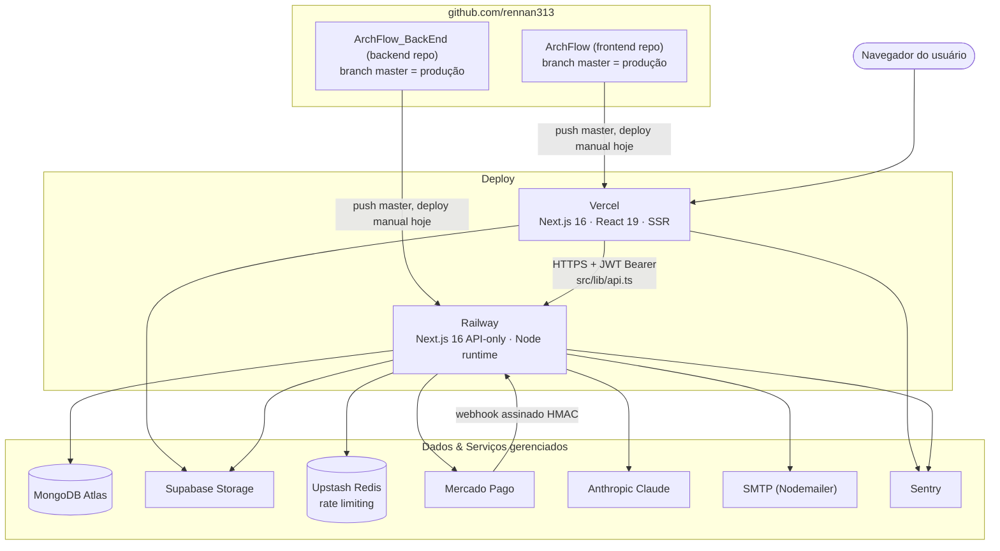
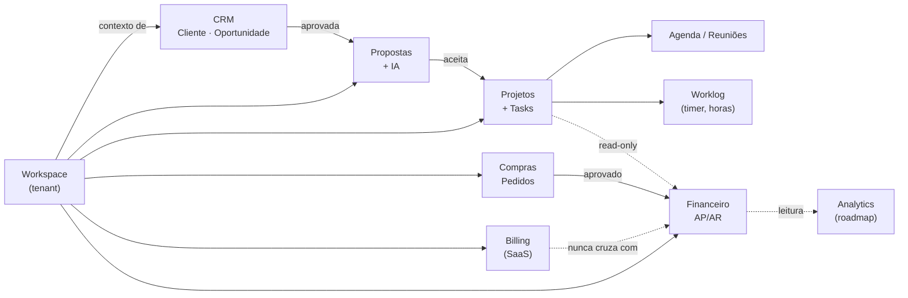
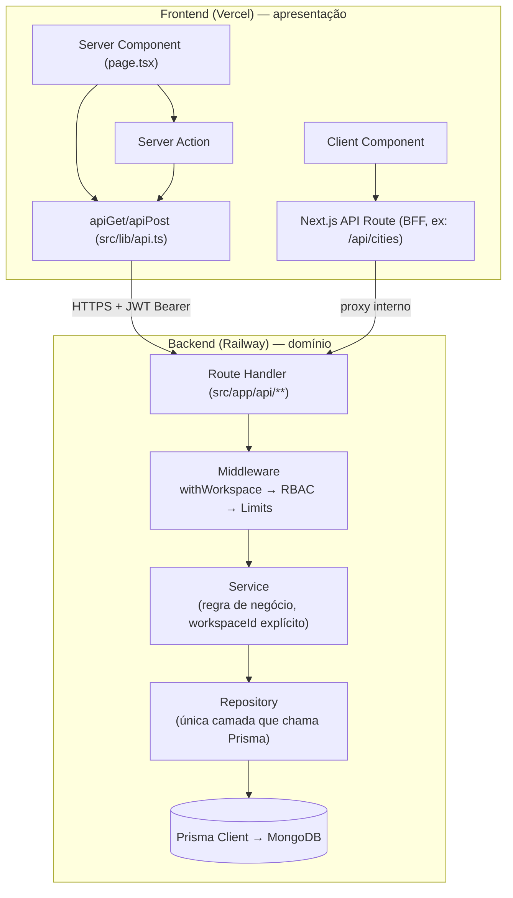
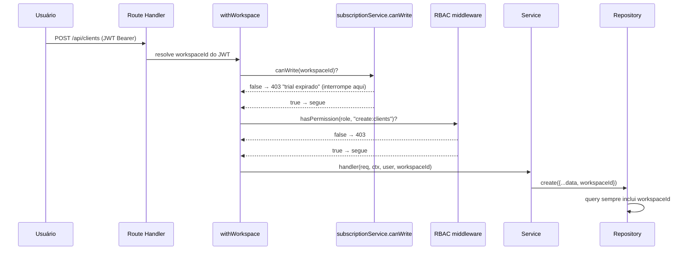
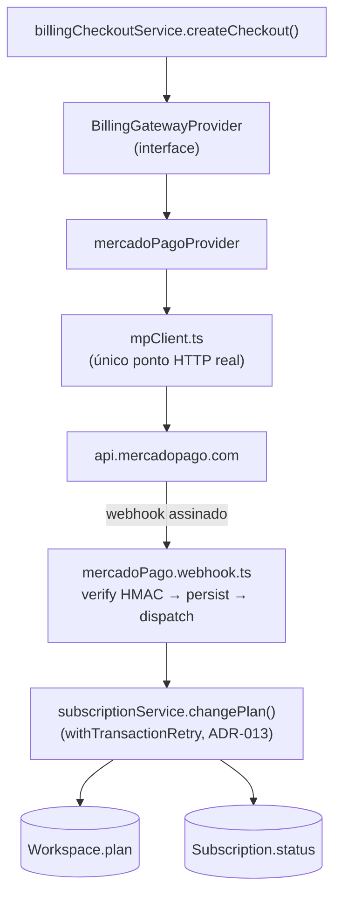
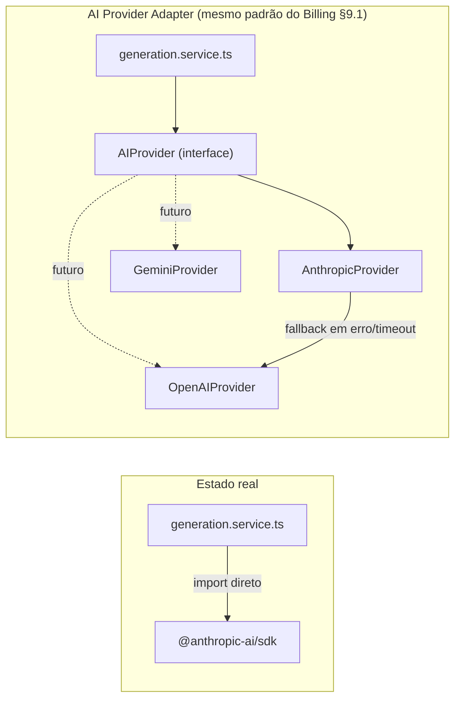
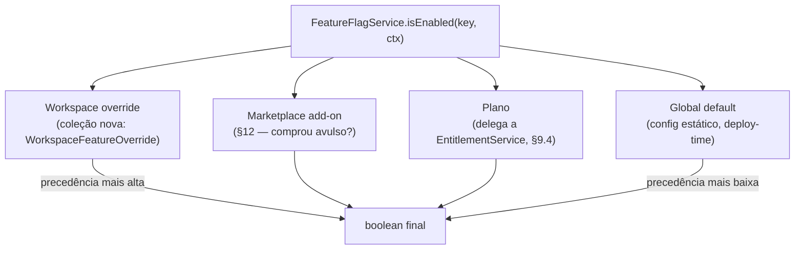
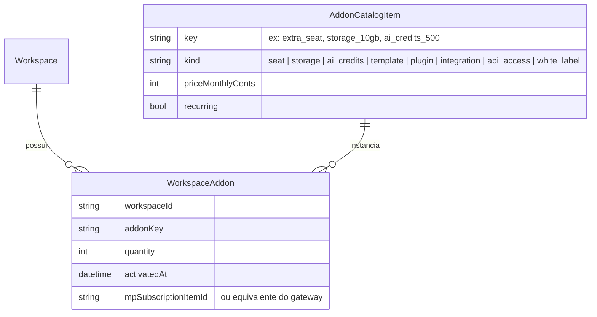
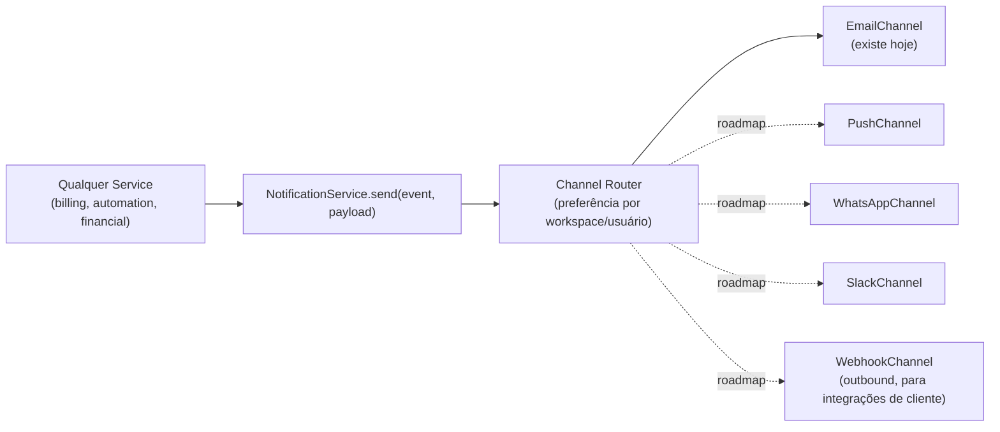
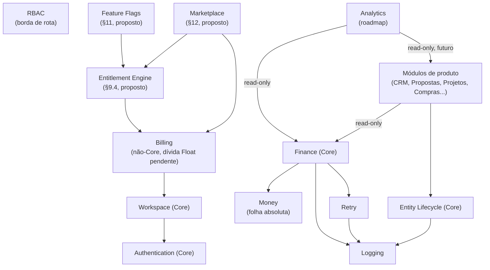

# Vincel Studio — Software Architecture v2

## Enterprise Master Architecture

**Status**: PROPOSTO — aguardando adoção formal via `ARCHITECTURE_GOVERNANCE.md` (este próprio documento está sujeito ao processo que ele define).
**Autor**: Chief Software Architect (função), sessão de auditoria + arquitetura, 2026-07-21.
**Escopo**: constituição técnica de toda a plataforma Vincel Studio — os dois processos de produção (`ArchFlow`/frontend, `ArchFlow_BackEnd`/backend) e todo módulo presente ou futuro.

---

## Como ler este documento

Este documento **não substitui** o corpo de decisões já registrado no backend — `ARCHITECTURE_GOVERNANCE.md`, `CORE_ARCHITECTURE_DECISIONS.md`, `CORE_MODULE_POLICY.md`, `DOMAIN_GUIDE.md`, `ENGINEERING_STANDARDS.md`, `ARCHITECTURE_ROADMAP.md`, `DEFINITION_OF_DONE.md`, `FINANCIAL_ARCHITECTURE_DECISIONS.md`, `COMPRAS_ARCHITECTURE_DECISIONS.md`, `WORKLOG_ARCHITECTURE_DECISIONS.md` — e as 20 ADRs numeradas e imutáveis que já existem. Esse corpo é maduro, ativo, e nasceu de incidentes e decisões reais (RC-2, RC-3, Sprint 0, Sprint 1). Reescrevê-lo destruiria o histórico do porquê de cada decisão.

Este documento é a **camada acima**: a visão de plataforma de 10 anos, os princípios que amarram frontend + backend como um único produto, a organização de módulos que ainda não existem (Analytics, Marketplace, White Label, API Pública, Feature Flags, Entitlement Engine), e o ponto de entrada único que qualquer engenheiro — humano ou agente de IA — deve ler antes de tocar qualquer módulo. Toda vez que este documento trata de um assunto que o backend já formalizou em detalhe, ele **referencia o documento fonte** em vez de reescrevê-lo; toda vez que trata de algo genuinamente novo (frontend, multi-tenancy full-stack, billing/entitlements, IA multi-provider, marketplace), ele é a fonte primária, escrita para ser eventualmente rebaixada aos módulos correspondentes conforme cada um deles ganha maturidade e sua própria ADR.

**Regra de precedência**: em qualquer conflito aparente entre este documento e uma ADR já publicada do backend, **a ADR vence** — este documento pode estar desatualizado nesse ponto e deve ser corrigido (documento vivo, não ADR — ver `ARCHITECTURE_GOVERNANCE.md` §7). Em qualquer conflito entre este documento e o código de produção, **audite antes de confiar em qualquer um dos dois** — este documento inclui, propositalmente, uma seção de dívida técnica conhecida (§7.5) documentando onde o código diverge do que está descrito aqui ou do que a página de preços promete.

---

## 1. Visão da Plataforma

### 1.1 Missão

Vincel Studio existe para que um escritório de arquitetura, engenharia ou design opere o negócio inteiro — captação, proposta, execução, financeiro, compras, equipe — em um único sistema, sem planilhas paralelas e sem reconciliar quatro ferramentas desconectadas. A tese de produto (Seção "Contexto" do prompt que originou este documento) é que a plataforma **não é um ERP genérico com um verniz de arquitetura** — é modelada em cima do vocabulário real do domínio (Oportunidade → Proposta → Projeto → Obra, Título → Parcela → Baixa, Fornecedor → Pedido de Compra), o que só é possível porque o Domain Guide do backend já trata isso como Bounded Contexts com linguagem ubíqua própria, não como tabelas genéricas de um framework CRUD.

### 1.2 Objetivos arquiteturais de 10 anos

1. **Nenhuma reescrita estrutural forçada.** Um módulo novo (Marketplace, Portal do Cliente, App Mobile) deve encaixar nas regras de dependência já estabelecidas (`CORE_MODULE_POLICY.md`) sem exigir que Core seja tocado.
2. **Multi-tenant desde a primeira linha, para milhares de workspaces.** `workspaceId` como fronteira única e obrigatória (ADR-006) já é esse compromisso — este documento estende a mesma garantia à camada de billing/entitlements, hoje o ponto mais fraco da plataforma (§7.5, §9).
3. **Modular Monolith, não microservices.** Ver §22 — a decisão está tomada e é definitiva para o horizonte deste documento; extração de serviço é um evento raro, deliberado, por módulo, nunca o padrão default.
4. **Crescimento internacional sem retrabalho.** i18n (`next-intl`, `pt/en/es`) já existe no frontend; o que falta é o mesmo tratamento no backend (mensagens de erro, e-mails) — ver §19.9, §24.
5. **Preparação para Marketplace e IA sem acoplar a nenhum fornecedor.** Billing já segue o padrão de Provider Adapter (`src/modules/billing/providers/`) — a decisão arquitetural central deste documento é generalizar esse MESMO padrão para IA (§10) e para o catálogo de add-ons vendáveis (§12), em vez de inventar um mecanismo novo para cada um.

### 1.3 Escalabilidade — o que já está pronto e o que não está

| Dimensão | Estado real hoje | Gatilho documentado para agir |
|---|---|---|
| Volume de dados por workspace | Índices compostos com `workspaceId` como prefixo (`ENGINEERING_STANDARDS.md` §6); sem particionamento | `PERFORMANCE_GUIDE.md` §3 — rollup materializado quando o dashboard financeiro ultrapassar o teto medido |
| Número de workspaces | Sem teto conhecido — Mongo Atlas + Railway escalam horizontalmente sem mudança de código | Nenhum — é o caso mais testado da arquitetura atual |
| Concorrência de escrita | `withTransactionRetry()` obrigatório (ADR-003/013) para toda escrita multi-coleção | Já em produção, mas não auditado fora do Financeiro (ver §7.5) |
| Cache | Redis (Upstash) existe **só para rate limiting** — não há camada de cache de leitura | §16 — proposto, não implementado |
| Observabilidade | Sentry (front+back) + `pino` estruturado; sem tracing distribuído | §15 — OpenTelemetry é roadmap, não estado atual |

### 1.4 Roadmap técnico (visão de 10.000 pés — detalhado em §24)

`v2` (este documento) → estabilizar Billing/Entitlements como módulo Core real (§9) → Analytics como leitura sobre o Core (já roteirizado em `ARCHITECTURE_ROADMAP.md` §2) → Portal do Cliente (segunda dimensão de tenant, já roteirizado) → Marketplace/Add-ons (§12) → API Pública versionada (§24) → White Label completo → App Mobile (consumidor HTTP puro, sem mudança de domínio) → Plugins de terceiros.

---

## 2. Princípios Arquiteturais

Esta seção declara **qual princípio é adotado de fato hoje, qual é adotado parcialmente, e qual é intencionalmente adiado** — a lista do prompt original inclui padrões (CQRS, Domain Events formal) que a arquitetura atual **deliberadamente não usa ainda**, e fingir que usa seria o tipo exato de "documento de arquitetura fictício" que este projeto está explicitamente evitando (ver o histórico desta sessão: o primeiro rascunho deste prompt assumia PostgreSQL/GCP/Supabase Auth/multi-IA, nenhum dos quais é real).

| Princípio | Estado | Onde vive |
|---|---|---|
| **DDD (Domain-Driven Design)** | ✅ Adotado, na variante pragmática do backend — Bounded Contexts, Aggregates com raiz+invariantes, Entidades vs Value Objects | `DOMAIN_GUIDE.md` — vocabulário oficial, este documento não redefine nada, só estende ao frontend/billing |
| **SOLID** | 🟡 Adotado informalmente via convenção de Service/Repository (Single Responsibility de fato: um service por entidade, um repository por entidade) — nunca formalizado como checklist | `ENGINEERING_STANDARDS.md` §2/§3 |
| **Clean Architecture (camadas)** | 🟡 Três camadas reais (Rota → Service → Repository), não quatro/cinco camadas de um Clean Architecture canônico (sem Use Case objects separados, sem Presenter) — decisão consciente de simplicidade, não lacuna | §3.3 deste documento |
| **Repository Pattern** | ✅ Adotado à risca — nenhum service chama `prisma` diretamente (`ENGINEERING_STANDARDS.md` §2) | `src/repositories/*.repository.ts` |
| **Service Layer** | ✅ Adotado — todo caso de uso é um método de service, nunca lógica de negócio dentro de uma rota | `ENGINEERING_STANDARDS.md` §2 |
| **CQRS** | 🔴 Não adotado, e não deve ser adotado sem gatilho medido. Leitura e escrita passam pelo mesmo model/repository hoje. O precursor de uma leitura separada já existe (`financialDashboardService`, "Analytics Base" em `CORE_MODULE_POLICY.md` — agregação read-only, mas ainda sobre o schema transacional, não um read-model separado) | Ver §17.5 — CQRS entra na conversa só quando o rollup materializado do `ARCHITECTURE_ROADMAP.md` §2 for implementado |
| **Domain Events** | 🟡 Dois mecanismos parciais coexistindo (Automações + audit log), nenhum barramento formal, nenhum event sourcing | `DOMAIN_GUIDE.md` §4 — catálogo consolidado em §13 deste documento |
| **Cloud Native** | 🟡 Cada processo é stateless e roda em PaaS gerenciado (Railway, Vercel) com scale horizontal automático — mas não é "cloud native" no sentido Kubernetes/container-orchestration; é PaaS-native. Ver §21 e §17-migração para a distinção com a visão-alvo GCP do prompt original | §21 |
| **Security by Design** | ✅ RBAC de borda (nunca no service), `workspaceId` obrigatório em toda query, HMAC em webhook, secrets nunca logados (`ENGINEERING_STANDARDS.md` §9 checklist de PR) | §20 |
| **Convention over Configuration** | ✅ Estrutura de módulo é um template copiável (`<nome>.module.ts` barrel, `services/`, opcionalmente `providers/`/`webhooks/`) — nenhuma escolha de framework por módulo | `ENGINEERING_STANDARDS.md` §1 |
| **Fail Fast** | ✅ `src/lib/env.ts` (ambos os repos) falha o boot se uma env var obrigatória em produção está ausente, distinguindo build-phase de runtime — não um "undefined" silencioso descoberto em produção | `ArchFlow_BackEnd/src/lib/env.ts`, `ArchFlow/src/lib/env.ts` |
| **Composition over Inheritance** | ✅ Nenhuma hierarquia de classes no domínio — services e middlewares são funções compostas (`requireWorkspacePermission(...)(handler)`), nunca uma classe base `BaseService` | `src/middlewares/rbac.ts`, `src/middlewares/limits.ts` |

**A regra prática que resume esta seção**: princípios de "processo de engenharia" (Repository, Service Layer, Fail Fast, Security by Design, Composition) são não-negociáveis e já cumpridos. Princípios de "arquitetura de dados em grande escala" (CQRS, Event Sourcing, particionamento) são **adiados até o gatilho medido aparecer** — adotá-los cedo demais é exatamente o erro que `ARCHITECTURE_ROADMAP.md` §2 já rejeitou explicitamente para Analytics ("implementar antes do gatilho é otimização prematura").

---

## 3. Arquitetura Geral

### 3.1 Topologia real (não é um monorepo)

A diferença mais importante entre este documento e o prompt que o originou: Vincel Studio **não é hoje um monorepo** — são dois repositórios Git independentes, cada um com seu próprio deploy:



**Achado operacional relevante (auditado nesta mesma sessão, não hipotético)**: nem Vercel nem Railway têm hoje deploy automático conectado ao push em `master` — os últimos deploys de produção de ambos os processos foram disparados manualmente via CLI (`railway up`, `vercel --prod`). Isso é uma lacuna real de DevOps, documentada formalmente em §21.6, não um detalhe do roadmap de 10 anos — é uma correção de curto prazo.

### 3.2 Fluxo de módulos (visão de produto)



### 3.3 Camadas (dentro de cada processo)



### 3.4 Comunicação (síncrona vs. assíncrona)

Hoje, **100% síncrono** — todo fluxo é request/response HTTP, incluindo o webhook do Mercado Pago (processado inline, resposta 200/401/500 ao gateway). Não há fila de mensagens, não há worker assíncrono, não há cron job de aplicação (o único "job" existente é o lazy-check `expireTrialIfNeeded`, disparado no request seguinte, não por scheduler). Isso é uma escolha consciente de simplicidade para o estágio atual — a primeira necessidade real de comunicação assíncrona (fila) tende a aparecer com Automações de alto volume ou o rollup do Analytics, e deve ser resolvida com uma ADR própria quando o gatilho aparecer, não antecipada.

---

## 4. Organização dos Módulos

Tabela consolidada — Core e não-Core do backend já estão definidos (`CORE_MODULE_POLICY.md`); esta seção adiciona a visão full-stack (o que existe no frontend) e o roadmap (o que não existe ainda).

| Módulo | Backend | Frontend | Core? | Fonte de detalhe |
|---|---|---|---|---|
| Auth | ✅ JWT/bcrypt, Google OAuth | ✅ NextAuth v5 | Sim | `CORE_MODULE_POLICY.md` §1 |
| Workspace | ✅ | ✅ (`store/`, guards) | Sim | `CORE_MODULE_POLICY.md` §2 |
| RBAC | ✅ 6 papéis, permissões granulares | 🟡 componente `RoleGuard.tsx` existe mas está órfão (zero uso — achado de auditoria) | Sim | `CORE_MODULE_POLICY.md` §3 |
| CRM (Cliente/Oportunidade) | ✅ | ✅ | Não | `DOMAIN_GUIDE.md` §1 |
| Projetos | ✅ | ✅ (+ Kanban de projeto) | Não | `DOMAIN_GUIDE.md` §1 |
| Propostas + IA | ✅ builder, biblioteca, PDF | ✅ | Não | `DOMAIN_GUIDE.md` §1, §10 deste doc |
| Financeiro | ✅ maduro (Release 1.0) | ✅ | **Sim** | `CORE_MODULE_POLICY.md` §4, `FINANCIAL_ARCHITECTURE_DECISIONS.md` |
| Compras | ✅ Fase 1 | ✅ | Candidato (não Core ainda) | `COMPRAS_ARCHITECTURE_DECISIONS.md` |
| Agenda/Reuniões | ✅ | ✅ | Não | `DOMAIN_GUIDE.md` §1 |
| Worklog | ✅ Fase 1 | ✅ (timer, sessões) | Não (Core-cândido futuro) | `WORKLOG_ARCHITECTURE_DECISIONS.md` |
| Automações | ✅ 10 gatilhos | ✅ | Não | `DOMAIN_GUIDE.md` §4.1 |
| Billing | ✅ (Mercado Pago) | ✅ | **Não hoje — dívida técnica bloqueia** (`CORE_MODULE_POLICY.md`: "Billing é deliberadamente não-Core... vira candidato quando a dívida Float vs BigInt for resolvida") | §9, §7.5 deste doc |
| **Analytics** | 🔴 Não existe (só agregações pontuais, "Analytics Base" ver `CORE_MODULE_POLICY.md` §8) | 🔴 Não existe | Roadmap | `ARCHITECTURE_ROADMAP.md` §2 |
| **Marketplace** | 🔴 Não existe | 🔴 Não existe | Roadmap | §12 deste doc (proposto aqui pela primeira vez) |
| **White Label** | 🟡 Branding existe (logo/cores), não é White Label completo (domínio próprio, e-mail com remetente do cliente) | 🟡 idem | Roadmap | §12.7 deste doc |
| **API Pública** | 🔴 Não existe (rotas internas só) | N/A | Roadmap | `ARCHITECTURE_GOVERNANCE.md` §6.3 (espaço reservado `/api/v1/`), §24 deste doc |
| **Feature Flags** | 🔴 Não existe mecanismo — flags de plano existem mas boa parte é código morto (ver §9.4) | 🔴 idem | Roadmap | §11 deste doc |
| **Portal do Cliente** | 🔴 Não existe | 🔴 Não existe | Roadmap | `ARCHITECTURE_ROADMAP.md` §3 |
| **Integrações** (Open Finance, NF-e) | 🔴 Não existe | N/A | Roadmap | `ARCHITECTURE_ROADMAP.md` §7 |

---

## 5. Estrutura de Pastas

### 5.1 Backend (`ArchFlow_BackEnd/`)

```
src/
  app/api/**/route.ts     Route Handlers — só parsing + delegação a middleware/service, zero regra de negócio
  middlewares/             withAuth, withWorkspace, rbac.ts, limits.ts, rateLimiter.ts — a borda de toda rota
  modules/<nome>/          Módulos com contrato externo (billing, financial, purchasing, worklog)
    <nome>.module.ts       Barrel — único ponto de import por rotas
    services/
    providers/              só se houver integração externa (padrão Provider Adapter, ver §9.1/§10.1)
    webhooks/               só se houver webhook externo
    validators/
  services/                 Services de domínio SEM módulo dedicado (ex.: subscription, workspace, project)
  repositories/*.repository.ts   Única camada que chama `prisma` — compartilhado por toda a app, nunca dentro de um módulo
  lib/                       Infraestrutura pura (money, auditLog, transactionRetry, env, jwt, prisma client extension)
  validations/*.ts           Schemas Zod — fronteira de toda rota/Server Action
  config/plans.ts            Fonte de verdade de limites de plano (ver §9.4 — hoje SUBUTILIZADA)
  utils/
prisma/schema.prisma         Fonte de verdade de dados — 85 models/enums, `db push` (sem migration SQL)
scripts/migrate-*.ts         Scripts de transformação de dados (permanecem no repo como histórico)
docs/                        Este ecossistema de documentos de arquitetura
```

**Regra explícita** (herdada de `ENGINEERING_STANDARDS.md` §1, repetida aqui porque é a regra mais violada por engenheiros novos): repositories **nunca** vivem dentro de `modules/<nome>/` — mesmo um módulo maduro como `financial/` não tem sua própria pasta `repositories/`. Rotas importam **do barrel do módulo**, nunca de `services/xxx.service.ts` diretamente.

### 5.2 Frontend (`ArchFlow/`)

```
src/
  app/[locale]/
    (auth)/                 Páginas públicas — sem guard
    (dashboard)/             layout.tsx guarda auth; page.tsx por módulo é SÓ Server Component fino
      [modulo]/page.tsx      Busca dados via apiGet, passa como props — nunca lógica de UI aqui
    pricing/                 Marketing público
  app/actions/*.ts           Server Actions — única forma de mutação; sempre `revalidatePath` após escrever
  app/api/**/route.ts        BFF — só para o que precisa rodar client-side (ex.: /api/cities, debounce)
  features/[modulo]/         TODA implementação de client component vive aqui, nunca em app/
    [Modulo]Client.tsx
    New[Modulo]Page.tsx
    [Modulo]DetailClient.tsx
    components/ · hooks/ · utils/
  components/
    ui/                      Design system primitivo (Button, Input, Badge...) — ver §19.2
    landing/ · pricing/       Seções de marketing
    guards/                   AuthGuard/GuestGuard/RoleGuard — **RoleGuard hoje é código morto, ver §7.5**
  lib/
    api.ts                   Cliente HTTP server-only, injeta Bearer automaticamente
    billing/featureGates.ts  **Código morto, ver §7.5** — não usar como referência de padrão até ser revivido ou removido
  store/                      Zustand — só sessão/usuário
  config/pricing.ts           **Dois configs de preço coexistindo hoje, um morto — ver §7.5**
messages/{pt,en,es}.json      i18n — chaves validadas em build time
```

**Divergência conhecida**: `ARCHITECTURE.md`/`PROJECT-STRUCTURE.md` do frontend estão desatualizados (não listam `finance/`, `purchasing/`, `worklog/`, `automations/`, `billing/`, `kanban/`, que já existem em `src/features/`) — este documento reflete a estrutura real auditada nesta sessão, não a documentada. Atualizar esses dois arquivos é item de backlog (§17 do DoD, §7.5).

---

## 6. Domain-Driven Design

Vocabulário e exemplos completos: `DOMAIN_GUIDE.md`. Esta seção só resume o mapeamento conceitual e estende às lacunas (Value Objects/Policies/Specifications que o Domain Guide não nomeia explicitamente, mas que existem de fato no código).

| Conceito DDD | Definição adotada em Vincel Studio | Exemplo real |
|---|---|---|
| **Entity** | Tem `id` e ciclo de vida rastreável | `FinancialDocument`, `Proposal`, `PurchaseOrder` |
| **Value Object** | Definido pelo valor, imutável, sem identidade | `Cents` (`src/lib/money/money.ts`), `FinancialDirection`, `idempotencyKey` |
| **Aggregate** | Cluster com raiz que garante invariantes, reforçado por código (Mongo não tem transação implícita entre coleções) | `FinancialDocument → Installment[] → Payment[]` (`DOMAIN_GUIDE.md` §2.1) |
| **Repository** | Única camada que fala com Prisma; sempre recebe `workspaceId` explícito | `src/repositories/*.repository.ts` |
| **Factory** | Não formalizado como padrão nomeado — a criação de aggregate complexo vive no método `create`/`createWithInstallments` do próprio repository/service (ex.: `financialDocumentRepository.createWithInstallments` calcula o total a partir das parcelas, nunca aceita do cliente) | Implícito, não uma classe `XFactory` separada — decisão consciente de não introduzir uma camada extra sem necessidade medida |
| **Policy** | Regra de autorização/negócio isolável — o mapa `PERMISSIONS` de RBAC é a Policy mais explícita do sistema; guards de exclusão (`hasDocumentsForClient`) são Policies de domínio não nomeadas como tal | `src/middlewares/rbac.ts`, guards em `*.service.ts#delete` |
| **Specification** | Não formalizado como padrão nomeado (`Specification` de GoF/DDD) — checagens compostas hoje são funções puras dentro do service (`canCreateProposal`, `canAddUser`) | `src/services/subscription.service.ts` |
| **Service** (Domain Service) | Todo caso de uso que não pertence naturalmente a uma única entidade | `subscriptionService.changePlan`, `entityLifecycleService` |
| **Use Case** | Não é uma classe própria (`XUseCase`) — é um método público de Service, uma decisão consciente de manter a camada de aplicação fina (§2, "Clean Architecture: três camadas, não cinco") | — |
| **Domain Event** | Ver §13 — catálogo consolidado | `AutomationKey`, `event`/`correlationId` do `auditLog` |

**Nota de honestidade arquitetural**: Factory/Policy/Specification como *padrões nomeados com classes próprias* não existem no código — existem como *responsabilidades cumpridas*, dentro de services/repositories. Isso é uma escolha de pragmatismo (`ENGINEERING_STANDARDS.md` inteiro é escrito nesse espírito), não uma lacuna a preencher às pressas. Se um módulo futuro (Marketplace, com regras de precificação de add-on combinatórias) precisar genuinamente de um objeto `Specification` composable, ele nasce ali, como ADR própria — não é retrofitted no Financeiro só para "completar o padrão".

---

## 7. Arquitetura de Serviços

Cada serviço abaixo tem hoje um destino real no código, exceto os marcados 🔴 (propostos por este documento, sem implementação).

| Serviço | Estado | Localização real / proposta |
|---|---|---|
| `PlanService` | 🟡 Existe como `subscriptionService.getWorkspacePlan`/`getEffectiveLimits`, não como classe própria | `src/services/subscription.service.ts` |
| **Entitlement Engine** | 🔴 Não existe como conceito único — hoje é 4 checagens ad-hoc (`canAddUser`, `canCreateProposal`, `canUploadFile`, `canUseFeature`) espalhadas, mais um middleware inteiro (`middlewares/limits.ts`) **sem nenhum call site** | Ver §9.4 — proposta de consolidação |
| `LimitService` | 🟡 Mesmo código que `PlanService`/`Entitlement Engine` hoje — não são serviços fisicamente separados | idem |
| `BillingService` | ✅ `billingCheckoutService`, `billingWebhookService`, `billingSubscriptionService`, `billingPlanService` | `src/modules/billing/services/` |
| `NotificationService` | 🟡 Só e-mail (`emailService`, Nodemailer) — sem push/WhatsApp/Slack | `src/services/email/email.service.ts`; §14 propõe generalização |
| `AuditService` | ✅ `auditLog()` (ADR-012) | `src/lib/auditLog.ts` |
| `StorageService` | 🟡 Acoplado a Supabase diretamente, sem camada de abstração de provider | `src/services/storage/` (backend), uploads via `documentService`/`mediaService` |
| `AIProvider` | 🔴 Não existe como abstração — código chama `@anthropic-ai/sdk` diretamente dentro de `generationService` | `src/services/ai/generation.service.ts`; §10.1 propõe adapter |
| `WorkspaceService` | ✅ | `src/services/workspace.service.ts` |
| `FeatureService` | 🔴 Não existe (ver Entitlement Engine acima e §11 Feature Flags) | — |
| `AnalyticsService` | 🟡 "Analytics Base" existe (agregações pontuais), não um serviço de analytics de produto | `CORE_MODULE_POLICY.md` §8; roadmap em `ARCHITECTURE_ROADMAP.md` §2 |
| `AutomationService` | ✅ | `src/services/automation.service.ts` |

### 7.5 Dívida técnica conhecida em Billing/Entitlements (auditada nesta sessão — não hipotética)

Esta subseção existe porque um documento de arquitetura que promete "Entitlement Engine" e "Feature Service" sem primeiro admitir o estado real do que já existe seria decorativo. Achados de auditoria read-only completa (mesma sessão):

- `middlewares/limits.ts` define `requireUserLimit`, `requireStorageLimit`, `requireDynamicStorageLimit`, `requireFeature` — **nenhum tem um único call site** em nenhuma rota. O enforcement real que existe foi implementado por chamada direta e duplicada a `subscriptionService.canX()` dentro de cada rota (`workspace/invite/route.ts:14`, `documents/route.ts:36-38`, `proposals/[id]/media/upload/route.ts:28-30`).
- `canCustomBranding`, `canExportPdf`, `canApiAccess` — **zero enforcement em produção**. Qualquer plano exporta PDF e usa marca personalizada hoje, apesar de a página de preços vender isso como diferencial pago.
- `aiCreditsPerMonth` — **decorativo**. `ai/generate-proposal/route.ts` retorna `tokensUsed` na resposta mas nunca persiste/soma uso; o único limite real aplicado é contagem de *propostas/mês*, não de créditos de IA.
- `maxProjects` — **sem enforcement algum**, nem inline nem via middleware.
- `canMoodboards`/`canAnalytics` — sem mecanismo de gate possível hoje (não há rota de moodboard dedicada; não há módulo Analytics).
- Frontend: `lib/billing/featureGates.ts` (`hasFeature`, `isWithinProjectLimit`, `isWithinUserLimit`, `getAiCreditLimit`) — zero call sites. `components/guards/RoleGuard.tsx` — zero call sites. `config/pricing.ts` tem dois objetos de preço (`pricingConfig` legado com preços desatualizados R$59/99/199, e `pricingPageConfig` sincronizado, usado pela página pública) — o legado só é referenciado pelo também-morto `featureGates.ts`.
- `PATCH /api/subscription/upgrade` retorna `501` hard-coded, com comentário afirmando que deveria ser reativado "quando o webhook do Mercado Pago estiver implementado e verificado em produção" — **já está**, desde esta mesma sessão de trabalho; o comentário está desatualizado e a rota não é usada pelo frontend (que usa `/api/billing/checkout`).

Este é exatamente o gap que §9 (Billing) e §11 (Feature Flags) deste documento propõem fechar — não como trabalho especulativo de 10 anos, mas como o primeiro item real de backlog de arquitetura (§17 tabela de esforço).

---

## 8. Multi-tenancy

### 8.1 Workspace como fronteira única (hoje)

`workspaceId` é a fronteira de tenant — ADR-006 ("workspace-first, sem exceção"), estendida por ADR-015 para entidades sem campo direto (filtro por relação com o pai). Todo middleware de rota (`withWorkspace`) resolve `workspaceId` do JWT **antes** de qualquer service rodar; todo repository inclui `workspaceId` na própria query, mesmo que a camada acima já tenha validado — defesa em profundidade, não confiança em uma única camada.



### 8.2 Tenant Context

Não existe hoje um `AsyncLocalStorage` de contexto de request global (rejeitado explicitamente por ADR-012 como fora de escopo até haver necessidade real de tracing ponta a ponta) — `workspaceId` é passado explicitamente por parâmetro em toda cadeia Service→Repository, nunca lido de um contexto implícito. Essa é uma escolha deliberada: torna impossível um bug de "esqueci de propagar o contexto" porque não há contexto implícito para esquecer — o custo é verbosidade (todo método leva `workspaceId` como parâmetro), aceito conscientemente.

### 8.3 Workspace Isolation — o que ainda falta

- **Row Level Security nativa do banco**: não existe — MongoDB não tem RLS como Postgres. O isolamento é 100% em código de aplicação (repository sempre filtra por `workspaceId`). Isso é uma superfície de risco real: um bug de repository que esqueça o filtro vaza dados entre tenants sem que o banco proteja. Mitigação atual: checklist de PR obrigatório (`ENGINEERING_STANDARDS.md` §9, primeiro item). Mitigação proposta: um teste de integração automatizado que varre todo repository e falha se algum `findMany`/`findFirst` não incluir `workspaceId` no `where` (não implementado hoje).
- **Workspace Cache**: não existe hoje nenhuma camada de cache de dados de workspace (plano, limites, RBAC) — toda resolução de `canWrite`/`getEffectiveLimits` é uma query Mongo por request. Ver §16 (Cache) para a proposta.
- **Workspace Audit**: parcial — `auditLog()` inclui `workspaceId` em todo evento (ADR-012), mas não há uma tela/relatório de "todas as ações deste workspace" consolidada — os logs existem, a agregação/consulta não.
- **Workspace Policies**: hoje é só RBAC (papel dentro do workspace). Não existem policies configuráveis por workspace (ex.: um workspace Enterprise decidir que só OWNER pode exportar PDF, mesmo que o plano permita ADMIN) — não há necessidade de produto identificada para isso ainda; documentado aqui só para não ser esquecido se o pedido aparecer.

### 8.4 Segunda dimensão de tenant (Portal do Cliente — roadmap)

Já roteirizado com o desenho arquitetural completo em `ARCHITECTURE_ROADMAP.md` §3: introduz `clientId` como uma segunda dimensão de escopo DENTRO do workspace, exigindo um tipo de sessão estruturalmente distinto (sem `workspaceRole`). Este documento não repete o desenho — só marca que é a mudança de multi-tenancy mais significativa do roadmap, e que toda decisão de Entitlement Engine (§9.4) e Feature Flags (§11) deve ser desenhada sabendo que uma segunda dimensão de escopo está a caminho, para não fechar prematuramente em "workspace é a única fronteira que sempre vai existir".

---

## 9. Billing

### 9.1 Arquitetura atual — Gateway Adapter (já correta, generalizar não reescrever)

Billing já segue o padrão certo: `src/modules/billing/providers/gateway.interface.ts` é o contrato; `providers/mercadoPago/mpClient.ts` é o único ponto HTTP real; `providers/index.ts` é o registry. **Este é o modelo de referência a copiar para qualquer integração de gateway futura** (segunda forma de pagamento, ou o `AIProvider` de §10.1) — não inventar um padrão de adapter novo por integração.



### 9.2 Subscriptions, Plans, Trials

- **Plans**: `Plan` enum (`STARTER|PROFESSIONAL|STUDIO|ENTERPRISE`) + `PLAN_LIMITS`/`PLAN_PRICING` (`config/plans.ts`, código, fonte de enforcement) + `BillingPlan` (Mongo, catálogo de exibição/preço/mapeamento Mercado Pago, seedado a partir do config, nunca lido pelo enforcement — divisão deliberada de responsabilidade).
- **Divergência conhecida**: 4 planos no backend vs. 3 vendidos publicamente — a página pública mapeia "Enterprise" → `STUDIO` internamente (`config/pricing.ts:131,199`, comentário explícito no código admitindo que os dois são funcionalmente idênticos hoje).
- **Trial**: 7 dias (`TRIAL_DURATION_DAYS`, `subscription.service.ts:28`), com `PLAN_LIMITS.STUDIO` liberado integralmente durante o trial, independente do plano nominal — "tudo liberado, sem free tier de fallback" é a decisão de produto registrada em código.
- **Downgrade/Upgrade**: `changePlan()` é a única função que escreve `Workspace.plan` + `Subscription`, sempre em transação com retry (ADR-013 generaliza a proteção de race condition do Financeiro para este exato método, disparado por webhook real de pagamento).
- **Proration**: 🔴 não implementado — uma troca de plano no meio do ciclo hoje não calcula crédito/débito proporcional. Ausente do código, ausente do roadmap formal até agora — registrado aqui como gap.
- **Cancellation**: `cancelAtPeriodEnd` — cancelamento não revoga acesso imediatamente, só marca intenção; um job futuro (não implementado — comentário explícito no código "Phase 2/3") é responsável por de fato rebaixar o acesso quando `currentPeriodEnd` passa.

### 9.3 Invoices, Credits, Coupons

- **Invoices**: `BillingHistory` (por cobrança: `amount`, `status`, `mpPaymentId`, `receiptUrl`, `rawPayload`) — implementado.
- **Credits**: 🔴 não existe como conceito de billing — "créditos de IA" (`aiCreditsPerMonth`) é um limite de uso, não um saldo comprável/transferível. Ver §12.3 (Marketplace) para onde essa distinção passa a importar de verdade.
- **Coupons**: 🔴 não implementado, sem schema, sem gateway support wireado.

### 9.4 Entitlements — a proposta central desta seção

**Problema**: hoje existem 4 checagens (`canAddUser`, `canCreateProposal`, `canUploadFile`, `canUseFeature`) e uma tabela `PLAN_LIMITS` com 12 campos, mas só 3 desses campos têm enforcement real, e o enforcement que existe está espalhado (chamadas inline duplicadas em vez de um único gate reusável) — exatamente a fragmentação que `CORE_ARCHITECTURE_DECISIONS.md` ADR-012/ADR-020 já resolveram para logging e lifecycle, generalizando um padrão dessa mesma família (um serviço central + um único ponto de checagem por rota) para billing.

**Proposta — Entitlement Engine, seguindo o MESMO padrão já provado por `entityLifecycleService` (ADR-020)**:

```ts
// Proposto — src/services/entitlement.service.ts (não implementado)
// Mesmo espírito de entityLifecycleService: um serviço central que não conhece
// nenhuma feature por nome — recebe a chave e resolve contra PLAN_LIMITS +
// uso real medido, nunca reimplementado por rota.
entitlementService.check(workspaceId, "canExportPdf" | "aiCreditsPerMonth" | ...): Promise<EntitlementResult>
entitlementService.consume(workspaceId, "aiCreditsPerMonth", amount): Promise<void>  // decremento atômico
```

Isso não é "adicionar Entitlement Engine porque o prompt pediu" — é **consertar** o que já foi construído e abandonado no meio (`middlewares/limits.ts`), consolidando em um serviço, e resolvendo a lacuna estrutural que falta para os campos hoje decorativos: `aiCreditsPerMonth` precisa de um contador persistido com reset mensal (não existe hoje — nenhuma coluna de uso em `Workspace`/`Subscription`), e `maxStorageMb` precisa trocar a estimativa grosseira (`mediaCount × 2MB`, `subscription.service.ts:116`) por medição real de bytes.

### 9.5 Webhooks e Idempotência

Já corretamente implementado: `PaymentEvent.externalId @unique` é a chave de idempotência (persist-before-process); assinatura HMAC verificada antes de qualquer processamento (`src/modules/billing/utils/signature.ts`); falha de processamento retorna 500 para o MP retentar, falha de assinatura retorna 401 (sem retry — decisão correta, uma assinatura inválida nunca deveria ter uma segunda chance). Nenhuma mudança proposta aqui — é o padrão de referência para qualquer webhook futuro (Marketplace, integrações de conciliação bancária do roadmap).

---

## 10. Inteligência Artificial

### 10.1 Estado real vs. visão-alvo do prompt original

O prompt que originou este documento pedia "OpenAI + Claude + Gemini" como stack oficial. **Isso não reflete o código**: hoje existe um único provedor (`@anthropic-ai/sdk`, chamado diretamente de dentro de `src/services/ai/generation.service.ts`), sem nenhuma camada de abstração — não há `AIProvider` interface, não há fallback, não há retry configurado no nível de provider (só o `aiRateLimit` de borda). Tratando isso como uma decisão de arquitetura pendente, não uma lacuna a esconder:



**Decisão proposta**: adotar multi-provider **só quando houver uma razão de negócio real** (custo, disponibilidade regional, ou uma feature que só um provedor específico resolve bem) — não como padrão default "porque é mais flexível". A interface `AIProvider` (Prompt Engine + Prompt Templates + geração + moderação) deve ser desenhada agora, seguindo o precedente do `BillingGatewayProvider`, mesmo que só `AnthropicProvider` exista por um bom tempo — o custo de introduzir a interface cedo é baixo (mesmo padrão já provado), o custo de fazer depois (quando `generationService` já tiver 13 arquivos acoplados a chamadas diretas do SDK, como já é o caso — `src/services/ai/*.ts`) é alto.

### 10.2 Prompt Engine, Templates, Library

Já existe uma proto-versão madura, mesmo sem nome formal: `prompt-builder.service.ts`, `premium-narrative-prompt-builder.service.ts` (construção de prompt), `library-context.service.ts` (biblioteca de blocos reutilizáveis injetada como contexto), `tone.service.ts` (variação de tom). Isso já é, na prática, um Prompt Engine + Prompt Library — falta só nomear e consolidar como camada explícita quando/se um segundo provedor for adicionado (hoje o acoplamento a "como o Claude especificamente espera o prompt" está implícito em vários desses arquivos).

### 10.3 Credits, Usage, Moderation, History

- **Credits/Usage**: ver §7.5/§9.4 — `tokensUsed` é retornado pela API mas nunca persistido. Este é o gap mais concreto e acionável de toda a seção de IA.
- **Moderation**: 🔴 não existe — nenhum filtro de conteúdo antes/depois da chamada ao Anthropic além do que o próprio provedor aplica.
- **History**: 🟡 parcial — o resultado da geração vira uma `Proposal`/`ProposalSectionInstance` persistida (histórico de negócio), mas não há um log dedicado de "todas as chamadas de IA feitas por este workspace" (relevante para cobrança de créditos e para auditoria de uso indevido).
- **Fallback/Retry multi-provider**: 🔴 não aplicável hoje (provedor único) — desenhado na interface proposta em §10.1 para quando o segundo provedor existir.

---

## 11. Feature Flags

🔴 **Não existe hoje um mecanismo de feature flag** — nem para plano (ver §7.5/§9.4, que é sobre *entitlement*, um conceito relacionado mas distinto), nem para experimentos, nem para beta features, nem overrides por workspace.

**Distinção importante que este documento formaliza pela primeira vez**: *Entitlement* (§9.4) responde "este workspace **pagou** por isto?" — é sempre derivado do plano/add-ons. *Feature Flag* responde "este código deveria estar **ligado** neste ambiente/workspace, independente de pagamento?" — cobre rollout gradual, beta fechado, kill-switch de emergência. Os dois sistemas são compatíveis e não devem ser fundidos em um só (o mesmo raciocínio de ADR-020 que separa Archived de Cancelled — dois eixos ortogonais, cada um com sua própria pergunta).

**Arquitetura proposta** (não implementada):



Ordem de precedência proposta (mais específico vence): override de workspace > add-on de marketplace comprado > entitlement de plano > default global. Nenhum destes níveis existe hoje exceto o `PLAN_LIMITS` estático — este é 100% roadmap, priorizado abaixo do conserto de Entitlements (§9.4), que é pré-requisito técnico (Feature Flags de plano é literalmente uma leitura do Entitlement Engine, não faz sentido construir antes dele).

---

## 12. Marketplace

🔴 Não existe hoje nenhuma infraestrutura de marketplace — nenhuma tabela, nenhuma rota, nenhum conceito de "item comprável avulso" no schema. Esta seção é a proposta arquitetural completa, para que o dia em que o produto decidir vender o primeiro add-on não comece do zero.

### 12.1 Modelo de dados proposto



### 12.2–12.9 Itens vendáveis (mapeados ao que o prompt pediu, cada um com o hook técnico real)

| Item vendável | Hook técnico | Depende de |
|---|---|---|
| Usuários extras | `WorkspaceAddon(kind: seat)` soma a `PLAN_LIMITS.maxUsers` antes de `canAddUser` decidir | Entitlement Engine (§9.4) somar plano + add-ons, não só ler o plano |
| Storage extra | idem, soma a `maxStorageMb` | Entitlement Engine + medição real de bytes (§9.4) |
| Créditos de IA extra | idem, soma a `aiCreditsPerMonth` — primeira vez que "Credits" (§9.3) vira um conceito de billing real, não só um limite | Contador de uso persistido (§9.4/§10.3) |
| Templates (biblioteca de propostas) | `ProposalTemplate`/`ProposalSection`/`ProposalBlock` já são entidades por workspace — um marketplace de templates é uma segunda origem (`sourceWorkspaceId` de um catálogo global) para o mesmo schema, não um novo | Nenhuma mudança estrutural — é dado, não código |
| Plugins | 🔴 sem hook hoje — exigiria um sistema de extensão (webhook de saída configurável, ou execução de código de terceiro em sandbox) fora do escopo deste documento | Roadmap de longo prazo, ver §24 |
| Integrações | Segue o padrão Provider Adapter (§9.1/§10.1) — cada integração paga é um novo `provider`, ativado por `WorkspaceAddon(kind: integration)` | `ARCHITECTURE_ROADMAP.md` §7 |
| API access | `canApiAccess` já existe como flag de plano (sem enforcement, §7.5) — marketplace só adiciona a opção de comprar avulso mesmo em plano que não inclui | §24 (API Pública) precisa existir primeiro |
| White Label | Ver §12.10 abaixo | — |

### 12.10 White Label — o que já existe vs. o que falta

Já existe: `OfficeBranding` (logo, logo-white, favicon, cores) — branding visual dentro do produto. **Falta para ser White Label de verdade**: domínio customizado por workspace (hoje `app.vincelstudio.com` é fixo), e-mail transacional com remetente/domínio do cliente (hoje `SMTP_FROM` é global, um único remetente para todos os workspaces), remoção completa de menções "Vincel Studio" da UI para o workspace com esse add-on. Nenhum desses três é uma mudança pequena — domínio customizado por tenant é uma mudança de infraestrutura (roteamento por `Host` header, certificado TLS por domínio), não só de schema.

---

## 13. Eventos de Domínio — Catálogo Oficial

Consolidação do que já existe (`DOMAIN_GUIDE.md` §4) com os dois mecanismos parciais explicitados — este documento não cria um terceiro mecanismo, só cataloga os dois existentes num único lugar full-stack.

### 13.1 Automações (`AutomationKey`) — disparam efeito

| Evento | Quando publicado | Efeito |
|---|---|---|
| `AUTO_CREATE_PROJECT_ON_APPROVED` | Proposta aprovada | Cria `Project` |
| `TASK_PRELIMINARY_DESIGN` / `TASK_EXECUTIVE_DESIGN` / `TASK_COMPATIBILIZATION` / `TASK_APPROVAL` | Transição de fase de projeto | Cria `Task` padrão da fase |
| `PROJECT_OVERDUE_ALERT` | Prazo de projeto vencido | Notifica (ver §14) |
| `PROPOSAL_STALE_FOLLOWUP` | Proposta sem interação há N dias | Notifica responsável |
| `MEETING_AGENDA_SYNC` | Reunião criada/alterada | Sincroniza agenda |
| `CLIENT_TIMELINE_INIT` | Cliente criado | Inicializa timeline |
| `POST_DELIVERY_FOLLOWUP` | Projeto entregue | Dispara follow-up pós-entrega |

### 13.2 Audit Log (`event` + `correlationId`, ADR-012) — só registram

Hoje concentrados no Financeiro/Billing/Lifecycle: `payment_created`, `payment_rejected`, `duplicate_attempt`, `document_created`, `document_cancelled`, `document_cancel_rejected`, `transactional_conflict`, `retry_executed`, `retry_exhausted`, `subscription_plan_changed`, `<entidade>_archived`/`_restored`/`_cancelled`/`_deleted` (ADR-020, qualquer uma das 15 entidades arquiváveis), `workspace_invite_accepted`.

### 13.3 Lacuna conhecida (`src/lib/events.ts`, legado)

Um terceiro catálogo mais antigo, sem `correlationId`, usado hoje só por Auth/IA (`AuthEvent`), com entradas nunca emitidas (código morto). `CORE_ARCHITECTURE_DECISIONS.md` ADR-012 já marca isso como padrão legado — "nenhum código novo deve adotá-lo", migração de Auth/IA fica pendente sem prazo formal. Este documento não muda essa decisão, só a repete para visibilidade full-stack.

### 13.4 Regra para eventos novos (qualquer módulo, incluindo os do roadmap)

Segue exatamente `DOMAIN_GUIDE.md` §4: se o evento precisa **disparar** outro efeito → padrão Automação. Se só precisa ser **registrado** → `auditLog`. Os dois nunca são substitutos um do outro. Um futuro barramento de eventos formal (Kafka/SQS/etc.) só se justifica quando um consumidor genuinamente assíncrono e desacoplado do request original aparecer (ex.: Marketplace processando um webhook de terceiro que não pode bloquear a resposta) — não antes.

---

## 14. Notification Service

### 14.1 Estado atual

Só e-mail transacional (`emailService`, Nodemailer/SMTP), disparado fire-and-forget a partir de services de domínio (`expireTrialIfNeeded` envia e-mail de trial expirado sem bloquear o write-gate — padrão explícito no código: "o e-mail nunca deve bloquear nem lançar no caminho de escrita quente"). Templates em `src/services/email/templates/` (layout compartilhado + templates por evento, ex. billing).

### 14.2 Arquitetura proposta — desacoplada por canal



O único trabalho estrutural necessário para chegar nesse desenho a partir do estado atual é extrair um `Channel Router` que hoje não existe (services chamam `emailService` diretamente, por nome, não um `NotificationService` genérico) — mesma forma de generalização já aplicada a Lifecycle (ADR-020) e Logging (ADR-012): um serviço central, cada canal um "delegate" plugável, nenhum chamador sabe qual canal específico está sendo usado.

---

## 15. Observabilidade

| Pilar | Estado |
|---|---|
| **Logs** | `pino` estruturado (backend), `auditLog()` para eventos de domínio (ADR-012) — formato único, `correlationId` presente só onde ADR-012 foi adotado (Financeiro/Billing/Lifecycle; Auth/IA ainda usam `events.ts` legado, §13.3) |
| **Tracing** | 🔴 Não existe tracing distribuído — nenhum OpenTelemetry, nenhuma propagação de trace-id entre frontend→backend hoje além do `correlationId` interno ao backend |
| **Metrics** | 🟡 `src/lib/metrics.ts` existe para o Financeiro (`timed()` em torno de operações de repository) — não é uma camada de métricas de aplicação genérica (sem Prometheus/StatsD, sem dashboard de métricas de negócio) |
| **Health Checks** | ✅ `GET /api/health` (`{"status":"ok","db":"ok"}`), usado pelo health check do Railway |
| **Sentry** | ✅ Ambos os processos, `@sentry/nextjs` — `environment` via `NODE_ENV`, `release` via `VERCEL_GIT_COMMIT_SHA`/`RAILWAY_GIT_COMMIT_SHA` (auto-injetados) |
| **Performance** | `PERFORMANCE_GUIDE.md` já documenta o processo de medição-antes-de-otimizar (ver ENGINEERING_STANDARDS.md §7) |

**Proposta de evolução, em ordem de custo/benefício**: (1) migrar Auth/IA de `events.ts` para `auditLog` (ADR-012 já pede isso, sem prazo) — custo baixo, fecha a lacuna de correlação mais visível; (2) `correlationId` propagado do frontend (gerado no Server Component/Server Action, enviado como header, ecoado pelo backend) — permite correlacionar um erro do usuário no Sentry do frontend com o log do backend que o causou, hoje impossível; (3) OpenTelemetry só quando houver um caso concreto de latência multi-serviço difícil de depurar sem trace distribuído — antes disso é instrumentação sem consumidor.

---

## 16. Cache

**Estado real, para não repetir o erro do prompt original**: Redis (Upstash) existe hoje **exclusivamente** para rate limiting (`@upstash/ratelimit`) — não há cache de request, query, dashboard ou entitlement em lugar nenhum do código.

### 16.1 Proposta de camadas de cache

| Camada | Justificativa | Chave proposta | Invalidação |
|---|---|---|---|
| **Entitlement Cache** | `getEffectiveLimits`/`canWrite` rodam em toda escrita — hoje é uma query Mongo por request | `entitlement:{workspaceId}` | Invalidar em `changePlan`, webhook de billing, ou TTL curto (30-60s) como rede de segurança |
| **Dashboard Cache** | Agregações do "Analytics Base" (`financialDashboardService`) são recalculadas a cada carregamento de tela | `dashboard:{workspaceId}:{period}` | TTL curto + invalidação explícita em toda escrita financeira relevante |
| **Query Cache** | Nenhuma hoje — proposto só para leituras de referência pública sem tenant (`State`/`City`, já candidatas naturais por não terem `workspaceId`) | `ref:cities:{search}` | TTL longo (dado quase estático) |
| **Request Cache** | Deduplicação de chamadas idênticas dentro do mesmo request (ex.: `getBrandingContext` chamado duas vezes na mesma geração de proposta) — hoje resolvido só onde alguém lembrou de fazer, não como padrão | Escopo de request (não Redis — memória do próprio request) | N/A, morre com o request |

**Estratégia de invalidação recomendada**: write-through explícito (o service que escreve também invalida a chave relacionada), nunca TTL como única defesa para dados que mudam por ação do usuário (billing, entitlements) — TTL curto só como rede de segurança contra um caminho de invalidação esquecido, nunca como estratégia primária. Nenhuma dessas camadas existe hoje; a ordem de prioridade de implementação é Entitlement Cache primeiro (é o que mais roda por request, uma vez por escrita) seguido de Dashboard Cache (é o que já tem o gatilho de performance documentado, `PERFORMANCE_GUIDE.md` §3).

---

## 17. Banco de Dados

### 17.1 Estado real: MongoDB, não PostgreSQL

Todo o padrão de "como evoluir o banco" já está formalizado para o MongoDB real do projeto: `ARCHITECTURE_GOVERNANCE.md` §5 (campo novo sempre opcional/default primeiro, backfill antes de tornar obrigatório), `ENGINEERING_STANDARDS.md` §5 (migrations são scripts `scripts/migrate-*.ts`, não SQL migration files) e §6 (índices compostos com `workspaceId` como prefixo, validados por `explain()`). Este documento não repete o conteúdo — referencia.

### 17.2 O que este documento adiciona: Views, Materialized Views, Particionamento

Nenhum dos três existe hoje. MongoDB tem equivalentes (`$merge` para materialização, sharding para particionamento) mas nenhum foi necessário até agora — o "Analytics Base" (§4, §16) é o candidato natural a uma primeira materialized view (`financial_summaries`, já desenhada em `ARCHITECTURE_ROADMAP.md` §2) quando o gatilho de volume disparar.

### 17.3 Soft Delete, Auditoria, Versionamento

Já formalizado e maduro: Entity Lifecycle (ADR-020, §6/§7 deste documento) é o padrão único de soft delete/arquivamento; `auditLog` (ADR-012) é a auditoria; `ProposalVersion`/`DocumentVersion` são os dois únicos casos de versionamento explícito de conteúdo hoje (não generalizado a outras entidades — decisão implícita de que só conteúdo longo/editável precisa de histórico de versões, não todo registro).

### 17.4 Migração de banco — Postgres é opção real, não decisão tomada

O prompt original assumia PostgreSQL/Cloud SQL como stack oficial. Isso **não é o estado atual** e este documento não recomenda a migração sem gatilho — mas registra formalmente os prós/contras para quando a pergunta for feita de novo (ver §24 Roadmap):

| A favor de migrar para Postgres | Contra migrar |
|---|---|
| Transações multi-tabela nativas (Mongo hoje depende de `$transaction`+`withTransactionRetry`, uma camada de aplicação inteira — ADR-003/013 — só para compensar a ausência disso) | Migração de 85 models, todos com `@db.ObjectId`, é um projeto de meses, não uma troca de connection string |
| Row Level Security nativa (fecharia a lacuna de §8.3 de vez) | Todo o schema já modela relações via escalar plano + filtro de aplicação (`DOMAIN_GUIDE.md` §5) — RLS exigiria redesenhar a estratégia de acesso, não só trocar o driver |
| Analytics/BI tooling mais maduro no ecossistema Postgres | O sistema de ADRs inteiro (20 decisões) foi otimizado para as características reais do Mongo (append-only, sem CHECK constraint, sem transação implícita) — boa parte perderia relevância, mas o *esforço* de tê-las escrito não se transfere automaticamente |
| Cloud SQL tem HA/backup gerenciado mais maduro que Mongo Atlas em alguns planos | Atlas já resolve isso hoje, no plano correto (M10+, per `DEPLOY_GUIDE.md`) |

**Recomendação deste documento**: não migrar sem um gatilho de negócio concreto (ex.: RLS se tornar requisito de compliance de um cliente Enterprise, ou uma necessidade de BI que o Mongo genuinamente não atende). Se o gatilho aparecer, é projeto próprio com ADR e roadmap dedicados — nunca uma "melhoria incremental" dentro de uma sprint de feature.

### 17.5 CQRS — quando entra na conversa

Só quando o rollup materializado (§16, §17.2) existir e um consumidor real precisar ler dele com um modelo de dados deliberadamente diferente do modelo de escrita (hoje as agregações já leem do mesmo schema transacional — não é CQRS, é só uma query mais pesada). Não antes.

---

## 18. Storage

| Capacidade | Estado |
|---|---|
| Arquivos/Imagens | ✅ Supabase Storage, bucket único (`SUPABASE_STORAGE_BUCKET`) por ambiente — não por workspace (isolamento é lógico via path/registro no Mongo, não bucket físico) |
| Versionamento | ✅ `DocumentVersion` — implementado para o módulo Documentos |
| Miniaturas | 🟡 Parcial — `ProposalMedia.thumbnail` existe para mídia de proposta (imagem/YouTube/Vimeo), não generalizado a todo upload |
| OCR futuro | 🔴 Não existe — nenhum hook no pipeline de upload para processar conteúdo de documento |
| Assinaturas digitais | 🔴 Não existe |

**Padrão a seguir para as três lacunas 🔴**: qualquer processamento assíncrono de arquivo (OCR, assinatura) deve ser modelado como um consumidor **read-only** do evento de upload (padrão Automação, §13.1 — "documento carregado" dispara um `AutomationKey` novo), nunca inline no caminho síncrono de upload — um upload de 50MB não deveria esperar OCR terminar para responder 201 ao usuário.

---

## 19. Frontend

### 19.1 Estado real

Next.js 16 App Router, React 19, TypeScript, Tailwind v4 — confirmado como stack real (não hipotético). Estrutura completa em §5.2.

### 19.2 Design System

`src/components/ui/` — primitivos reais confirmados: `Button` (variantes primary/secondary/ghost/danger/outline/ai), `Input` (label/error/hint/icon), `Badge`/`StatusDropdown` (proposta), `CityCombobox` (busca debounced). **Não existe hoje** um design system documentado como tokens exportáveis/Storybook — `DESIGN-SYSTEM.md` existe mas não foi auditado nesta sessão para atualidade (mesmo aviso de possível desatualização que se aplica a `ARCHITECTURE.md`/`PROJECT-STRUCTURE.md`, §5.2).

### 19.3 Server vs. Client Components

Regra já em vigor e correta, confirmada por auditoria de código: `page.tsx` é sempre Server Component fino (busca dados via `apiGet`, repassa como props); toda implementação real de UI interativa vive em `features/[modulo]/*Client.tsx`. `src/lib/api.ts` é explicitamente **server-only** — nunca importado em Client Component (Client Components que precisam de dados ao vivo usam rotas BFF locais, ex. `CityCombobox` → `/api/cities`).

### 19.4 TanStack Query

Presente nas dependências (`@tanstack/react-query`), usado para estado de servidor no lado client onde Server Components não bastam (ex.: buscas com debounce, mutação otimista). Não auditado exaustivamente nesta sessão qual % de features usa TanStack Query vs. Server Action + `revalidatePath` — os dois padrões coexistem conforme o caso (mutação simples → Server Action; busca interativa client-side → TanStack Query + rota BFF).

### 19.5 Forms

`react-hook-form` + `@hookform/resolvers` + `zod` — validação client-side espelhando os schemas Zod do backend (duplicação deliberada: o backend nunca confia na validação do frontend, ver `ENGINEERING_STANDARDS.md` §2 "todo input passa por Zod antes de tocar o service").

### 19.6 Accessibility

Não auditado nesta sessão como item dedicado — nenhuma evidência de testes de acessibilidade automatizados (`axe`, etc.) no pipeline (`vitest`/`playwright` existem para lógica/E2E, não confirmado cobertura de a11y). Item de backlog a confirmar, não a assumir como resolvido nem como ausente sem verificação.

### 19.7 Dark Mode

✅ Implementado via atributo `data-theme` em `<html>` + variáveis CSS `--th-*` (`src/app/globals.css`) — **nunca** `dark:` do Tailwind, regra reforçada tanto em `CLAUDE.md` do projeto quanto em `ARCHITECTURE.md`. Cookie `vincel_theme` persiste a escolha, aplicado server-side no layout raiz (sem flash de tema errado).

### 19.8 Internacionalização

✅ `next-intl`, 3 locales (`pt` default, `en`, `es`), chaves validadas em build time. **Só no frontend** — o backend não internacionaliza mensagens de erro/e-mail (toda mensagem de `ErrorCode`/e-mail transacional é pt-BR fixo). Isso é uma lacuna real para "crescimento internacional" (§1.2, objetivo #4) — mensagens de erro do backend deveriam, no mínimo, ser códigos que o frontend traduz, nunca strings finais vindas do backend (parcialmente já assim via `ErrorCode`, mas alguns `reason:` de `LimitCheckResult`/`subscriptionService` são strings em inglês/português já formatadas no backend, não traduzíveis pelo frontend — ex.: `subscription.service.ts:75` monta a mensagem final em inglês).

---

## 20. Segurança

| Prática | Estado |
|---|---|
| **OWASP Top 10** | Cobertura pontual confirmada (RBAC de borda, Zod em toda fronteira, HMAC em webhook) — sem checklist OWASP formal auditado como processo recorrente |
| **LGPD** | 🔴 Não auditado nesta sessão — nenhuma menção a DPA, política de retenção de dados pessoais, ou mecanismo de "exportar/apagar meus dados" encontrada durante a auditoria de billing/features. Item a investigar antes de qualquer claim de conformidade |
| **JWT** | ✅ Backend: `jsonwebtoken` + `bcryptjs`, access+refresh token (`JWT_EXPIRES_IN`/`JWT_REFRESH_EXPIRES_IN`). Frontend: NextAuth v5, sessão em cookie httpOnly |
| **OAuth** | ✅ Google (`google-auth-library` no backend, NextAuth provider no frontend) |
| **RBAC** | ✅ Maduro — ver `CORE_MODULE_POLICY.md` §3, 6 papéis, mapa de permissões granular, exceção de "dono do recurso" (`requirePermissionOrOwner`) |
| **Permissions** | ✅ String `verbo:recurso`, wildcard `read:*`, allow-list fechada por papel |
| **Secrets** | ✅ Nunca em log (checklist de PR, `ENGINEERING_STANDARDS.md` §9); env vars via `src/lib/env.ts` fail-fast em produção |
| **Rate Limit** | ✅ Upstash Redis (`@upstash/ratelimit`), obrigatório em produção (`requiredInProdOptional`) — single instance cai para in-memory em dev |
| **CSRF** | Não auditado explicitamente nesta sessão — Next.js Server Actions têm proteção CSRF nativa desde a v14; não confirmado se rotas de API tradicionais (`route.ts`) têm proteção equivalente configurada |
| **XSS** | React escapa por padrão; não auditado uso de `dangerouslySetInnerHTML` no código |
| **CSP** | Não auditado — nenhuma menção a header CSP configurado encontrada |
| **Encryption** | Em trânsito: HTTPS via Vercel/Railway (TLS gerenciado pela plataforma). Em repouso: dependente do Mongo Atlas/Supabase (gerenciado pelo provedor, não configurado explicitamente pela aplicação) |

**Recomendação de curto prazo**: os itens marcados "não auditado" (LGPD, CSRF em rotas de API, CSP) não devem ser assumidos como resolvidos nem como ausentes — merecem uma auditoria de segurança dedicada (`security-review`/`security-scan`, já disponíveis como skills neste ambiente) antes de qualquer claim de compliance para um cliente Enterprise.

---

## 21. DevOps

### 21.1 Estado real (auditado nesta sessão, não hipotético)

| Prática | Estado |
|---|---|
| Docker | 🟡 Railway usa Dockerfile gerado automaticamente (Railpack/Nixpacks) — não há `Dockerfile` autoral no repo confirmado nesta sessão |
| CI/CD | 🔴 **Não existe** — nenhum GitHub Actions workflow confirmado; deploys são manuais via CLI (`railway up`, `vercel --prod`) hoje, mesmo para `master`/produção |
| Cloud Run | ❌ Não usado — Railway (backend) e Vercel (frontend), não GCP |
| Cloud SQL | ❌ Não usado — MongoDB Atlas |
| Redis | ✅ Upstash, só rate limiting (§16) |
| Deploy | Manual, ambos os processos, confirmado nesta mesma sessão de trabalho |
| Rollback | Railway/Vercel mantêm deploys anteriores navegáveis nativamente (rollback via dashboard/CLI de cada plataforma) — nenhum processo formal de rollback documentado além disso |
| Backups | MongoDB Atlas (PITR recomendado em `DEPLOY_GUIDE.md`, não confirmado como ativado) |
| Ambientes | Produção confirmada (`master`); não confirmado ambiente de staging real conectado a CI |
| Preview Deploy | Vercel gera preview deploys nativamente por PR/branch (recurso da plataforma); Railway não tem o equivalente configurado nesta sessão |

### 21.2 Ação corretiva imediata (não é roadmap de 10 anos — é a semana que vem)

1. **Conectar GitHub → deploy automático** em ambas as plataformas (Vercel Git Integration, Railway GitHub trigger) — hoje um merge em `master` não implica deploy, o que já causou uma divergência real nesta sessão (deploy do Railway 5 dias atrás do `master`, pré-rebrand).
2. **CI mínimo** (GitHub Actions): `npm run build` + `npm test` + `npm run lint` em todo PR, antes de qualquer branch protection real fazer sentido.
3. **Branch protection em `master`** nos dois repos — hoje ausente (`DEPLOY_GUIDE.md` já lista isso como pendência conhecida, não implementada).

### 21.3 Ambientes propostos (não implementados)

`dev` (dev local) → `preview`/PR (automático) → `staging` (opcional, se um cliente Enterprise exigir validação antes de produção) → `production`. Hoje só `production` existe de fato como ambiente com deploy real.

---

## 22. Arquitetura Modular

### 22.1 Modular Monolith — decisão definitiva, não provisória

Este documento **não propõe microservices** em nenhum horizonte de 10 anos — cada processo (frontend, backend) é um monolito modular, com módulos internos desacoplados por convenção de import (barrel `<nome>.module.ts`, `CORE_MODULE_POLICY.md`), não por fronteira de rede. A extração de um módulo para serviço próprio é um evento raro e deliberado (ex.: se Analytics precisar de um runtime de processamento genuinamente diferente do resto da app), nunca o padrão default — todo módulo novo nasce dentro do monolito.

### 22.2 Regras de dependência (já formalizadas, este documento não as reescreve)

A regra central já existe e é rigorosamente seguida: **dependência entre bounded contexts é sempre unidirecional, sem lógica de negócio compartilhada** (`DOMAIN_GUIDE.md` §6). O grafo completo de dependências entre módulos Core já está desenhado em `CORE_MODULE_POLICY.md` (Money ← Logging/Retry ← Finance ← Workspace/Módulos de produto, sem ciclos por construção). Este documento estende essa regra aos módulos do roadmap:



**Regra explícita para os módulos propostos**: Entitlement Engine depende de Billing (precisa saber o plano), nunca o inverso. Feature Flags depende de Entitlement Engine (§11 já formaliza isso). Marketplace depende de Entitlement Engine E Billing (é o que estende ambos com add-ons). Nenhum desses três módulos propostos pode ser importado por Finance, Money, Logging, Retry ou RBAC — eles são consumidores da fundação Core, nunca o contrário, preservando o princípio "Core não sabe que módulos de produto/billing existem" que já vale hoje para Finance.

### 22.3 Nenhum módulo acessa implementação interna de outro

Reforço explícito do que `ENGINEERING_STANDARDS.md` §1 já exige: toda comunicação entre módulos passa pelo barrel (`<nome>.module.ts`) ou por uma interface explícita (`BillingGatewayProvider`, e futuramente `AIProvider`) — nunca um `import { helperInterno } from "../outro-modulo/services/x.service"` direto. Isso vale com o mesmo rigor para os módulos propostos neste documento: `entitlementService` expõe `check()`/`consume()`, nunca expõe como calcula uso interno de storage.

---

## 23. Architecture Decision Records — Catálogo

### 23.1 ADRs já publicadas (backend) — este documento não as duplica

Ver `CORE_ARCHITECTURE_DECISIONS.md` (ADR-012 a 015, 020), `FINANCIAL_ARCHITECTURE_DECISIONS.md` (ADR-001 a 011), `COMPRAS_ARCHITECTURE_DECISIONS.md` (ADR-016 a 018), `WORKLOG_ARCHITECTURE_DECISIONS.md` (ADR-021 a 023). Numeração global, sequencial, imutável — próxima disponível: **ADR-024**.

### 23.2 Candidatas a ADR — propostas por este documento, aguardando processo formal

Este documento **não** cunha ADRs novas por conta própria (isso violaria `ARCHITECTURE_GOVERNANCE.md` §1 — "nenhuma decisão registrada é alterada silenciosamente", e uma ADR nasce do processo, não de um documento de visão). O que segue é a fila de candidatas, priorizada:

| # proposto | Título | Gatilho para virar ADR real |
|---|---|---|
| ADR-024 (candidata) | Entitlement Engine consolida `middlewares/limits.ts` morto + as 4 checagens inline em um serviço único (§9.4) | Antes de vender qualquer diferenciador de plano nesta conversa com o cliente — hoje é uma promessa não cumprida em produção |
| ADR-025 (candidata) | `AIProvider` interface, mesmo padrão de `BillingGatewayProvider` (§10.1) | Quando um segundo provedor de IA for genuinamente necessário — desenhar a interface antes, não depois |
| ADR-026 (candidata) | Correlation ID propagado do frontend ao backend (§15) | Quando o primeiro incidente exigir correlacionar um erro do usuário com o log do backend e isso não for possível hoje |
| ADR-027 (candidata) | CI/CD mínimo + deploy automático conectado ao Git (§21.2) | Imediato — é a única candidata deste catálogo sem gatilho de espera, é lacuna operacional já materializada nesta sessão |
| ADR-028 (candidata) | Billing sai de "não-Core" quando a dívida Float→BigInt for resolvida (referenciada por `CORE_MODULE_POLICY.md`, ainda sem ADR própria) | Resolver a dívida documentada no Anexo D de `FINANCIAL_ARCHITECTURE_DECISIONS.md` |

---

## 24. Roadmap Arquitetural

Consolidação de `ARCHITECTURE_ROADMAP.md` (que já cobre Compras, Analytics, Portal do Cliente, Centro de Inteligência, Obras, Mobile, Integrações, IA-no-Financeiro em detalhe técnico completo — não repetido aqui) com os módulos que só este documento cobre:

| Fase | Escopo | Depende de |
|---|---|---|
| **v2 (este documento)** | Constituição publicada; Entitlement Engine consertado (§9.4); CI/CD mínimo (§21.2) | — |
| **v2.x** | Compras Fase 2 (Quotation separado, catálogo de item) — conforme `ARCHITECTURE_ROADMAP.md` §1 | Demanda real medida |
| **v3 — Analytics** | Rollup materializado (`ARCHITECTURE_ROADMAP.md` §2) | Gatilho de volume documentado em `PERFORMANCE_GUIDE.md` §3 |
| **v3 — Portal do Cliente** | Segunda dimensão de tenant (`ARCHITECTURE_ROADMAP.md` §3, §8.4 deste doc) | Entitlement Engine estável (portal provavelmente tem seu próprio nível de acesso) |
| **Marketplace** | §12 deste documento | Entitlement Engine + Billing sair de "não-Core" (ADR-028 candidata) |
| **API Pública** | Versionamento por URL (`/api/v1/`, espaço já reservado por `ARCHITECTURE_GOVERNANCE.md` §6.3) só quando houver consumidor externo real | Primeiro consumidor real: Mobile (abaixo) ou um parceiro de integração |
| **Aplicativo Mobile** | `ARCHITECTURE_ROADMAP.md` §6 — consumidor HTTP puro, sem mudança de domínio | Obras (§5 do roadmap) como motivador real, não o CRM/Financeiro |
| **White Label** | §12.10 deste documento | Domínio customizado por tenant (mudança de infraestrutura, não só de código) |
| **Plugins** | Fora de escopo detalhado — exigiria sandbox de execução de terceiro | Nenhum gatilho de produto identificado ainda |
| **Enterprise** (SLA, RLS, auditoria avançada) | Cruza vários itens acima (Postgres §17.4 se RLS virar requisito; Analytics para relatórios; Portal para clientes finais) | Primeiro cliente Enterprise real com requisito específico — não construir especulativamente |

---

## 25. Definition of Done

Ver `DEFINITION_OF_DONE.md` para o DoD já vigente por módulo. Este documento adiciona os critérios que se aplicam **através** de todos os módulos, incluindo os propostos aqui:

Um módulo (novo ou alterado) só é considerado concluído quando:

1. **Segue a estrutura de `ENGINEERING_STANDARDS.md` §1** — barrel próprio, repositories fora do módulo, `workspaceId` explícito em toda função pública de service.
2. **RBAC mapeado explicitamente** — nunca herda `read:*` por padrão sem decisão consciente (`ENGINEERING_STANDARDS.md` §1, checklist).
3. **Toda entidade arquivável delega a `entityLifecycleService`** (ADR-020) — nunca reimplementa arquivamento próprio.
4. **Toda escrita multi-coleção usa `withTransactionRetry()`** (ADR-013) — sem exceção, independente do módulo.
5. **Todo valor monetário é `BigInt` em centavos via `@/lib/money`** — nunca `Number`/`Float` (ADR-001, generalizado por ADR-013 a todo módulo).
6. **Se o módulo introduz um limite/feature vendável, ele usa o Entitlement Engine (§9.4) desde o primeiro commit** — nunca um novo par de "campo em `PLAN_LIMITS` + checagem inline duplicada", que é exatamente a dívida que este documento existe para não repetir (§7.5).
7. **Se o módulo introduz uma integração externa nova, segue o padrão Provider Adapter** (§9.1/§10.1) — nunca uma chamada HTTP direta espalhada por múltiplos arquivos.
8. **Testes cobrem comportamento real** (branch de erro, invariante), não só caminho feliz, e não infla cobertura com CRUD fino sem lógica (`ENGINEERING_STANDARDS.md` §4).
9. **Nenhum segredo em log; toda query de domínio filtra por `workspaceId` dentro da própria query** (checklist de PR, `ENGINEERING_STANDARDS.md` §9).
10. **Se o módulo é Core (`CORE_MODULE_POLICY.md`) ou altera regra de dependência entre bounded contexts, tem uma ADR publicada antes do merge** (`ARCHITECTURE_GOVERNANCE.md` §1) — nunca depois, como formalização retroativa.
11. **Documentação deste ecossistema atualizada no mesmo PR** quando a mudança afeta um documento vivo (`ENGINEERING_STANDARDS.md`, `DOMAIN_GUIDE.md`, este documento) — ADRs nunca são editadas (§23), mas os documentos vivos são, e "atualizar depois" é como `ARCHITECTURE.md`/`PROJECT-STRUCTURE.md` do frontend ficaram desatualizados (§5.2).

---

## Apêndice — Proveniência deste documento

Escrito numa sessão que também: (1) auditou e concluiu a configuração de produção do Mercado Pago (credenciais, webhook secret, deploy de `develop` para `master` em ambos os repos); (2) executou uma auditoria read-only completa de inventário de features × gating por plano, cujos achados populam §7.5, §9.4 e §11 deste documento com evidência real de código, não suposição. As duas perguntas de esclarecimento respondidas antes de escrever este documento (stack real vs. stack do prompt original; camada acima das ADRs existentes vs. reescrita do zero) são a razão pela qual este documento tem a forma que tem — um "master architecture" que se recusa a inventar uma plataforma diferente da que está em produção.
